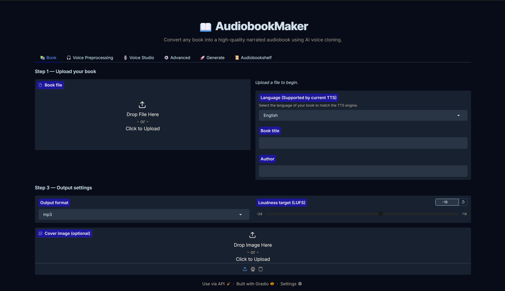
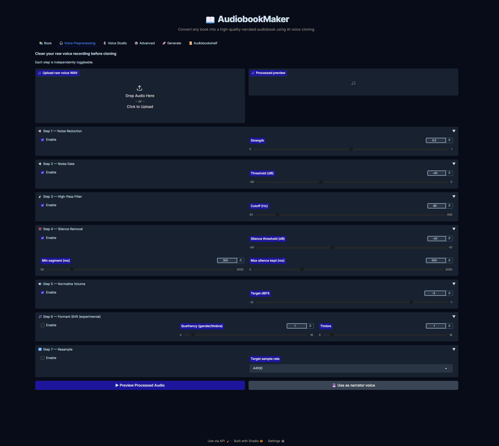
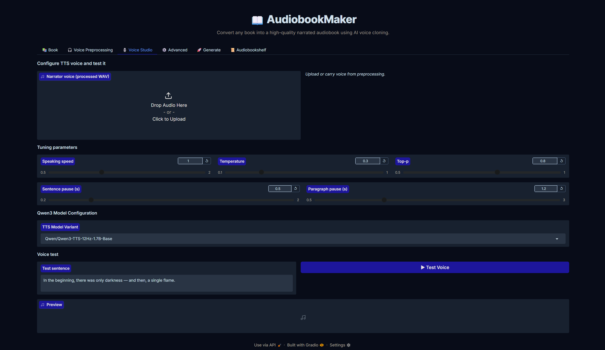
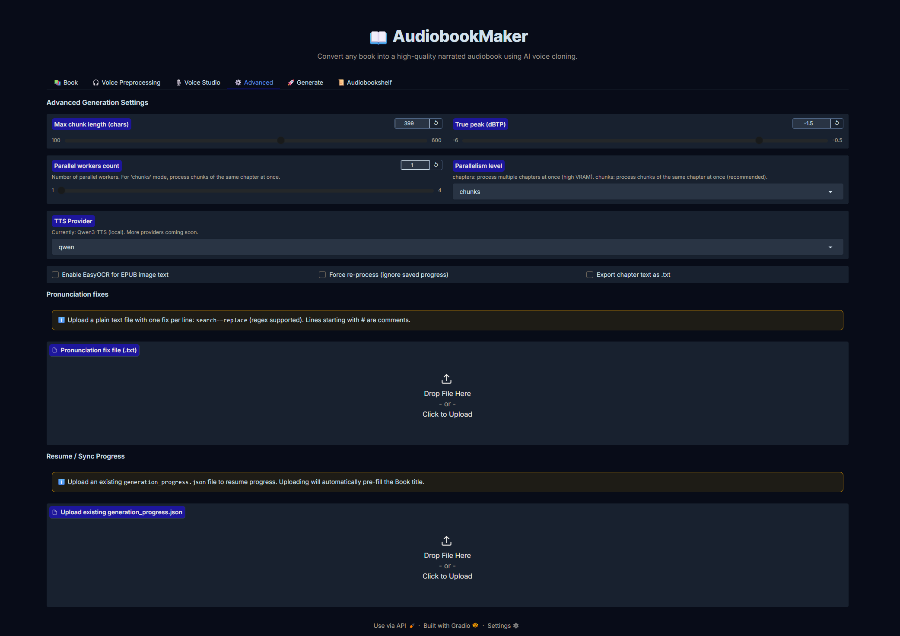
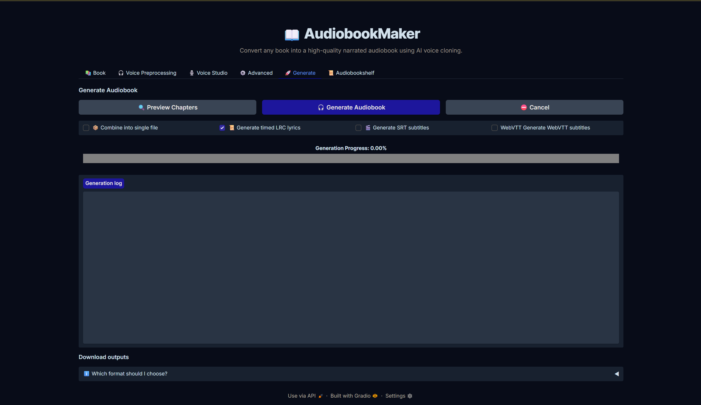

# 📖 AudiobookMaker


An end-to-end AI audiobook generator with a **Gradio web UI** and a **Headless CLI pipeline**. Upload any book, clone a narrator voice, clean it up, and generate a chapterized, mastered audiobook — all locally or in **Google Colab / Kaggle**, no cloud APIs needed.

---

## ✨ Features

- **Headless CLI generation (`cli.py`)** — Run audiobook generation headless in cloud environments (Kaggle/Colab) or terminal without launching or maintaining a web browser interface.
- **Cached Book Extraction** — `generation_progress.json` now caches fully extracted and segmented chapter text. Re-parsing large books on session resume is completely eliminated!
- **Export Config JSON** — Configure voice and chapters in Gradio, then click **'📋 Export Config JSON'** to save settings and cached text into a self-contained JSON ready for CLI execution.
- **Multi-format book support** — EPUB, MOBI, PDF, DOCX, ODT, TXT
- **Smart chapter detection** — EPUB/MOBI use a TOC-based chapter checklist; PDF/DOCX/ODT let you split by page ranges
- **Chapter selection memory** — Selected chapters are saved into `generation_progress.json` and automatically restored when you resume a session — no need to re-select every time. Uploading a book after restoring JSON settings preserves your selected chapter subset automatically.
- **JSON-First UI Workflow** — Progress file upload placed at the very top of the app interface for immediate session restore before touching book uploads.
- **AI text extraction** — 5-phase pipeline (Docling + OCR + ML classification + heuristic normalization) produces clean, TTS-ready text
- **EPUB image OCR** — EasyOCR reads text embedded in images inside EPUBs
- **Voice Design & Cloning** — Clone from a reference WAV or prompt an entire new voice using Qwen3-TTS. Supports **8 languages** (English, Chinese, Japanese, Korean, French, Spanish, Italian, German).
- **Voice preprocessing** — 7-step audio cleaning pipeline: noise reduction, noise gate, high-pass filter, silence removal, normalization, formant shifting, resampling
- **Voice test tab** — Type any sentence and preview the cloned voice before generating. Includes language-labeled premium timbres for optimized results.
- **Preview mode** — See chapter list with character + word counts before committing to a full audiobook run.
- **Pronunciation fixes** — Upload a `.txt` file with `search==replace` pairs to fix how the TTS pronounces specific words.
- **Parallel processing with Shared VRAM** — Process multiple chapters simultaneously using a **Global Shared Provider**. This allows worker counts up to 4 without multiplying VRAM usage, utilizing a thread-safe GPU lock with asynchronous disk I/O for maximum performance.
- **Synced Lyrics Export** — Automatically generates `.lrc` timed lyrics files perfect for Audiobookshelf syncing.
- **Audiobookshelf-compatible output** — Zero-padded filenames + full ID3 tags (title, author, album, track) ready to drop into Audiobookshelf.
- **Mastered Output & Single File Mode** — Output mastered MP3, FLAC, WAV, or M4B files. Optionally combine all chapters into a massive single unified file with one click.
- **Live generation log & Decimal Progress** — Stream progress in real time with a **sub-chapter decimal progress bar** (e.g. 74.52%) and detailed live logs.
- **FastAPI / WebSocket Orchestration Server** — Offloads heavy GPU jobs from Gradio to a detached FastAPI backend. Protects GPU VRAM limits via a sequential task queue while providing real-time log and rendering progress updates via WebSockets.
- **`torch.compile()` Speed Optimization** — Enable kernel fusion rendering to compile Qwen3 TTS model via the GPU compiler, speeding up audio generation throughput on RTX GPUs.
- **Smart Attention Backend** — Automatically detects whether `flash_attn` is installed. Uses **Flash Attention 2** if available, otherwise gracefully falls back to PyTorch's built-in **SDPA** — no crashes on T4 or other GPUs that don't have `flash_attn`.
- **Re-generate missing files control** — New checkbox on the Generate tab lets you decide whether chapters marked "completed" but missing audio should be re-generated or silently skipped.
- **Modular TTS provider system** — Qwen3-TTS built-in; async processing keeps your GPU at peak utilization.
- **Google Colab support** — Full end-to-end pipeline works directly in Google Colab via the included `AudiobookMaker_Colab.ipynb` notebook with a public shareable Gradio link.

---

## 🖥️ UI Preview

### 📚 Book Tab — Upload & Chapter Selection


### 🎧 Voice Preprocessing Tab — 7-Step Audio Cleaning


### 🎙️ Voice Studio Tab — Clone & Test Voice


### ⚙️ Advanced Tab


### 🚀 Generate Tab — Live Log & Download


---

## 🗂️ Project Structure

```
AudiobookMaker/
├── install.sh / install.bat              ← One-click installer (detects OS + GPU)
├── run.sh / run.bat                      ← Start app + open browser automatically
├── app.py                                ← Gradio UI entry point
├── start_api.py                          ← FastAPI orchestration server launcher
├── requirements.txt
├── AudiobookMaker_Colab.ipynb            ← Google Colab notebook (full pipeline, shareable link)
├── audiobook_rust/                       ← Rust PyO3 extension for SIMD sentence splitting and audio mastering
├── docs/
│   └── preview/                          ← UI screenshots
├── api/
│   ├── server.py                         ← FastAPI server (task queue, WebSocket progress streaming)
│   └── worker.py                         ← Background task consumer (sequential GPU queue)
└── audiobook_factory/
    ├── extractor_engine.py               ← Core AI text extraction engine
    │                                        (DocumentIngestor, MLClassifier, TextNormalizer)
    ├── text_extractor.py                 ← Public API: scan() + extract()
    ├── voice_preprocessor.py             ← 7-step voice audio cleaning pipeline
    ├── pipeline.py                       ← Thread-safe audiobook generation orchestrator
    │                                        (AudiobookConfig, CancelToken, run_pipeline)
    ├── filename_sanitizer.py             ← Cross-platform, Audiobookshelf-compatible filenames
    ├── text_processing.py                ← Sentence splitting + NLTK auto-download + normalization
    ├── ffmpeg_utils.py                   ← FFmpeg encoding helpers
    ├── utils.py                          ← Shared utilities (progress file management)
    └── tts_providers/                    ← Modular TTS provider abstraction
        ├── base_tts_provider.py          ← BaseTTSProvider ABC + get_tts_provider() factory
        └── qwen_provider.py              ← Qwen3-TTS (Flash Attention 2 / SDPA auto-detect, X-vector cloning)
```

---

## ⚙️ Prerequisites

- **Python 3.11+**
- **NVIDIA GPU with 6 GB+ VRAM** (strongly recommended — CPU is very slow for Qwen3-TTS)
- **CUDA Toolkit 11.8+**
- **FFmpeg** — the installer tries to handle this automatically

> **Note:** Flash Attention 2 is optional. If the `flash_attn` package is not installed (e.g. on **T4 GPUs** in Colab), the app automatically falls back to PyTorch SDPA — no manual action needed.

---

## 📦 Clone Repo
```
git clone https://github.com/MSpider3/AudiobookMaker.git
cd AudiobookMaker
```

---

## 🚀 Installation

The installer automatically:
- Detects your OS and installs **Python 3.11** via the native package manager
- Creates a **virtual environment**
- Detects your **GPU** and installs the correct PyTorch (CUDA 12.1, CUDA 11.8, or CPU)
- Installs all **dependencies** from `requirements.txt`
- Detects if the **Rust toolchain (cargo)** is installed, compiling the high-performance PyO3 extension (`audiobook_rust`) in release mode (with fallback to pure Python if Rust is not present)
- Installs **FFmpeg** if missing

### Windows
```bat
install.bat
```

### macOS / Linux (Ubuntu, Fedora, Mint, Arch, openSUSE, …)
```bash
chmod +x install.sh
./install.sh
```

---

## ▶️ Running the App

The run script activates the environment, starts the server, and opens your browser automatically.

### Windows
```bat
run.bat
```

### macOS / Linux
```bash
chmod +x run.sh
./run.sh
```

Your browser will open at **http://localhost:7860** automatically.

---

## ⚡ Headless CLI Generation (`cli.py`)

For faster generation or execution in cloud environments (Google Colab / Kaggle notebooks) where Gradio tunnels might disconnect, you can run generation headless via `cli.py`:

### Quick CLI Usage

```bash
# Basic run with progress JSON (uses cached chapter text):
python cli.py audiobook_output/MyBook/generation_progress.json

# Override book path (for cover image extraction) and narrator voice:
python cli.py generation_progress.json \
    --book-path /path/to/book.epub \
    --voice-file /path/to/voice.wav

# Override generation parameters on the fly:
python cli.py generation_progress.json \
    --worker-count 4 \
    --output-format mp3 \
    --output-dir ./my_output

# Force re-processing all chapters:
python cli.py generation_progress.json --force-reprocess
```

### CLI Workflow

1. Configure your settings, narrator voice, and chapter selections in the Gradio Web UI.
2. In the **Generate** tab, click **📋 Export Config JSON**. This saves `generation_progress.json` containing all settings and embedded chapter text.
3. Close or stop the Gradio app.
4. Run `python cli.py generation_progress.json` in your terminal or cloud notebook.


---

## ☁️ Google Colab

You can run AudiobookMaker entirely in **Google Colab** — no local GPU or installation required.

### Quick Start

1. **Open** [`AudiobookMaker_Colab.ipynb`](AudiobookMaker_Colab.ipynb) in Google Colab (or upload it manually).
2. **Enable a GPU runtime:** Go to **Runtime → Change runtime type → T4 GPU** → Save.
3. **Run all cells in order.** The notebook will:
   - ✅ Check GPU availability (`nvidia-smi`)
   - 📁 Clone the AudiobookMaker repository automatically
   - 🦀 Install the Rust compiler toolchain (`rustup`)
   - 📦 Install FFmpeg + all Python requirements
   - ⚙️ Compile the `audiobook_rust` PyO3 extension with `maturin` (with graceful Python fallback if compilation fails)
   - 🚀 Start the **FastAPI orchestration server** in the background
   - 🎨 Launch the **Gradio Web UI** with a public `gradio.live` shareable link

4. **Click the generated `gradio.live` link** to open the UI.

### Notes on Colab Environment

| Behaviour | Detail |
|-----------|--------|
| **Flash Attention** | T4 GPUs don't have `flash_attn` pre-installed. The app auto-detects this and uses PyTorch SDPA — generation still works. |
| **NLTK punkt_tab** | NLTK 3.9+ requires the `punkt_tab` resource. AudiobookMaker downloads both `punkt` and `punkt_tab` automatically on first run. |
| **Rust module fallback** | If `maturin` compile fails, the pipeline gracefully falls back to pure Python text cleaning — audiobooks will still generate. |
| **Session persistence** | Upload your `generation_progress.json` to resume a previous run — all settings, chapter selection, and voice are restored automatically. |
| **Runtime limit** | Free Colab sessions disconnect after ~12h. Use the progress file to resume where you left off. |

---

## 📋 Step-by-Step Usage

### 1. 📚 Book Tab
1. Upload your book file (`.epub`, `.mobi`, `.pdf`, `.docx`, `.odt`, `.txt`)
2. **EPUB / MOBI with TOC** → A chapter checklist appears. Tick the chapters you want to convert. Use *Select All* / *Deselect All* for quick bulk selection.
3. **PDF / DOCX / ODT / MOBI (no TOC)** → Enter page ranges, e.g. `1-50, 51-120, 121-250`. Each range becomes a separate chapter file.
4. **TXT** → No page structure; the whole file becomes one audio file automatically.
5. **Language Selection** → Choose the language of your book from the dropdown. This tells the TTS engine which phonetic dictionary to use.
6. Fill in book title, author, choose output format and LUFS loudness target.

> **Tip:** Your chapter selection is automatically saved to `generation_progress.json` when generation starts. Upload that file later to restore your exact chapter picks without re-selecting.

### 2. 🎧 Voice Preprocessing Tab *(recommended before cloning)*
Upload your raw voice WAV and run any combination of these steps:

| Step | What it does |
|------|-------------|
| Noise Reduction | Reduces background hiss/hum |
| Noise Gate | Silences frames below a dB threshold |
| High-Pass Filter | Removes low-frequency rumble |
| Silence Removal | Strips long silences between words |
| Normalize Volume | Peaks at your chosen dBFS |
| Formant Shift | Adjust voice gender/timbre *(experimental)* |
| Resample | Convert to 22k / 44.1k / 48k Hz |

Click **▶ Preview Processed Audio** to hear the result, then **💾 Use as narrator voice** to pass it to the next tab.

### 3. 🎙️ Voice Studio Tab
1. Upload or carry over the processed voice WAV.
2. Select a **TTS Model Variant** (Base for cloning, CustomVoice/VoiceDesign for prompting).
3. Choose a **Premium Timbre** (if using CustomVoice). Choices are prefixed with their native language (e.g., `[English] ryan`, `[Japanese] ono_anna`) for the best quality match.
4. Adjust TTS tuning parameters (speed, temperature, top-p, sentence/paragraph pauses).
5. Type any sentence in the **Voice Test** box and click **▶ Test Voice** to hear a preview.

### 4. ⚙️ Advanced Tab
- **Max chunk length** — TTS input character limit per sentence chunk (default 399).
- **Parallel chapter workers** — Process 1–4 chapters simultaneously. Thanks to our **Shared VRAM** architecture, increasing this does not significantly increase memory usage, but can dramatically speed up generation by pre-fetching the next sentence while the current one is speaking.
- **TTS Provider** — Currently: `qwen` (Qwen3-TTS). More providers will be added in future releases.
- **EasyOCR** — Enable to extract text from images embedded inside EPUB files
- **Force reprocess** — Re-extract text even if cached output exists
- **Export chapter text** — Write a `.txt` file alongside each audio file with the cleaned chapter text
- **Pronunciation fix file** — Upload a `.txt` with one fix per line in `search==replace` format (regex supported). Comments start with `#`.
  ```
  # Fix common TTS mispronunciations
  Barbadoes==Barbayduss
  N\.E\.==north east
  Dr\.==Doctor
  ```
- **Resume / Sync Progress** — Upload an existing `generation_progress.json` to resume a previous session. All settings (voice, model, format, chapter selection) are automatically restored to the UI.

### 5. 🚀 Generate Tab
1. Click **🔍 Preview Chapters** to see a table of chapter titles, character counts, word counts, and sentence counts — without generating any audio. Great for checking your chapter selections.
2. Click **🎧 Generate Audiobook** to start the full pipeline.
3. Watch the **Live Decimal Progress Bar** and log stream.
4. Use **⛔ Cancel** to stop at any time.
5. **🔄 Re-generate completed chapters whose audio file is missing** *(new checkbox)*:
   - **Checked (default):** If a chapter is marked `completed` in the progress JSON but the audio file is missing on disk, it will be automatically re-generated.
   - **Unchecked:** Chapters marked completed but with missing files are silently skipped — useful when files exist in a different location.
6. When complete, download individual chapter files or use **⬇ Download All (ZIP)**

---

## 🛠️ Customizing the Project

### Change the TTS model
Edit `audiobook_factory/tts_providers/qwen_provider.py`:
```python
# In _load_base_model():
"Qwen/Qwen3-TTS-12Hz-1.7B-Base"   # replace with any compatible Qwen3 checkpoint

# In _run_genesis():
"Qwen/Qwen3-TTS-12Hz-1.7B-VoiceDesign"   # design model used once for voice genesis
```

### Add a new TTS provider (future)
1. Create `audiobook_factory/tts_providers/my_provider.py`
2. Subclass `BaseTTSProvider` and implement `synthesize()`, `estimate_cost()`, `get_name()`
3. Register the name in `base_tts_provider.get_tts_provider()`
4. Add the name to the `tts_provider_dd` dropdown in `app.py`

### Tune the text extraction pipeline
Edit `audiobook_factory/extractor_engine.py`:
- **`TextNormalizer._strip_noise()`** — add/remove markdown patterns to clean
- **`TextNormalizer._fix_isolated_capitals()`** — font-kerning fixes (e.g. `T HE` → `THE`)
- **`_SKIP_TOC_TITLE`** regex — controls which TOC entries are excluded (copyright, gallery, etc.)
- **`MLClassifier.predict_is_chapter()`** — swap in a trained XGBoost model here when ready

### Tune audio mastering
Edit `audiobook_factory/pipeline.py`:
```python
lufs:      int   = -18    # loudness target
true_peak: float = -1.5   # max true peak dBTP
```
Or adjust these in the UI (LUFS slider in Book tab, True Peak in Advanced tab).

### Add a new output format
Edit `audiobook_factory/ffmpeg_utils.py` — add a new entry to `get_format_settings()`.

### Modify the voice preprocessing pipeline
Edit `audiobook_factory/voice_preprocessor.py`:
- Each step is a standalone function — easy to add, remove, or reorder
- `PreprocessConfig` dataclass controls all defaults

---

## 📦 Supported Input Formats

| Format | Chapter Detection | Fallback |
|--------|-----------------|---------| 
| EPUB | ✅ TOC chapter list | — |
| MOBI | ✅ Try TOC | Page-range picker |
| PDF | ❌ | Page-range picker |
| DOCX | ❌ | Page-range picker |
| ODT | ❌ | Page-range picker |
| TXT | ❌ | Whole book |

---

## 📦 Output Formats

| Format | Notes |
|--------|-------|
| MP3 | Default, most compatible |
| FLAC | Lossless |
| WAV | Uncompressed |
| M4B | Audiobook format with chapter markers (Apple Books) |

---

## 🎧 Audiobookshelf Integration

[Audiobookshelf](https://github.com/advplyr/audiobookshelf) is a self-hosted audiobook library server. AudiobookMaker generates output that Audiobookshelf automatically detects:

1. **Drop the output folder** into your Audiobookshelf library directory
2. Audiobookshelf will auto-scan and import it as a book
3. Each chapter file has the correct **ID3 metadata** (title, author, album, track number) so chapter ordering and library display work correctly out of the box

Output filenames follow the `{NNNN}_{Chapter_Title}.mp3` format Audiobookshelf expects.

---

## 🔒 Security & Local File Access

Modern versions of Gradio implement sandbox security checks that restrict browsers from loading server-generated files directly. To ensure seamless operation, AudiobookMaker automatically whitelists the project root directory using `allowed_paths=[_ROOT]` inside `app.py`. This enables:
- Transferring processed audio from the **Voice Preprocessing** tab directly to the **Voice Studio** tab without errors.
- Viewing and downloading final generated output audio/ZIP chapter packages directly from the web interface.

---

## 📝 Recent Changes

### Session & Resume Improvements
- **Chapter selection is now persisted** in `generation_progress.json`. When you upload a progress file to resume generation, the **chapter checkbox list is automatically restored** to the exact same selection — no need to manually re-select chapters each time.
- **New "Re-generate missing files" checkbox** on the Generate tab gives you control over what happens when a chapter is marked `completed` but its audio file is missing on disk.

### Robustness & Stability Fixes
- **Flash Attention 2 auto-detection**: The TTS model loader no longer requires `flash_attn` to be pre-installed. It detects availability at runtime and gracefully falls back to PyTorch SDPA — preventing crashes on T4 GPUs in Colab and other environments.
- **NLTK `punkt_tab` auto-download**: NLTK 3.9+ requires a new `punkt_tab` resource for sentence tokenization. AudiobookMaker now automatically checks for and downloads both `punkt` and `punkt_tab` on startup, preventing pipeline crashes on fresh environments.
- **`CancelToken` attribute fix**: Resolved an `AttributeError` in the API worker that caused the cancellation flow to crash (`'CancelToken' object has no attribute 'cancelled'` → fixed to use `.is_cancelled`).
- **Rust module graceful fallback**: Added `hasattr()` guards around all Rust extension calls (`clean_text`, `normalize_text`, `split_sentences`, `master_audio`). The pipeline continues with pure-Python implementations if the Rust module was compiled without certain functions.

### Google Colab Support
- Added `AudiobookMaker_Colab.ipynb` — a step-by-step notebook that installs the full environment (Rust toolchain, FFmpeg, Python deps, PyO3 compilation) and launches the Gradio UI with a public shareable link, all within a Google Colab session.

---

## 🙏 Acknowledgements

This project would not have been possible without the incredible work from these projects:

### [Qwen3-TTS](https://github.com/QwenLM/Qwen3-TTS) by QwenLM
The voice cloning and TTS engine powering all audio generation in this project.
State-of-the-art text-to-speech with zero-shot voice cloning from a short reference clip.

### [Mangio-RVC-Fork](https://github.com/Mangio621/Mangio-RVC-Fork) by Mangio621
The voice preprocessing pipeline in this project (noise reduction, noise gate, high-pass filter, silence removal, formant shifting) is directly inspired by the preprocessing architecture used in Mangio-RVC-Fork.

---

## 📄 License

Apache 2.0 — see [LICENSE](LICENSE) for details.
