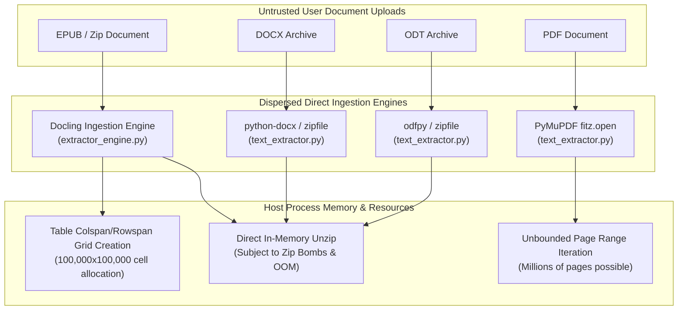
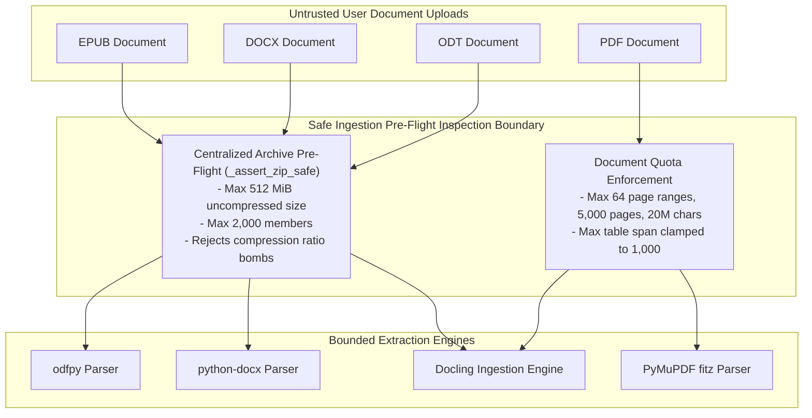

# Security Hardening Proposal: Centralized Archive Pre-flight Ingestion & Resource Sandboxing

## Decision
We must decide how to insulate AudiobookMaker from untrusted archive-based document formats (EPUB, DOCX, ODT) and dense document structures (PDFs, multi-thousand-cell HTML tables) that can exhaust host CPU and memory resources.

## Executive Recommendation
I recommend **Option 1: Centralized Ingestion Pre-Flight Validator with Hard Quotas (Current Baseline)** as the immediate standard, with **Option 2: Out-of-Process Worker Sandbox** reserved for multi-user cloud deployments. Our implementation of Option 1 unified zip decompression validation via `_assert_zip_safe`, bounded PDF extraction ranges to 5,000 pages / 20M characters, and clamped HTML table dimensions to 1,000 cells. This directly neutralized the decompression bomb and resource exhaustion vulnerabilities identified in `VULN-04`, `VULN-05`, `VULN-06`, `VULN-07`, and `VULN-08` without adding multi-process architectural overhead.

The options evaluated are:
1. **Option 1: Unified Pre-Flight Archive & Structural Quotas (Current Baseline)**
2. **Option 2: Process-Isolated Ingestion Sandbox with OS Resource Limits (cgroups/RLIMIT)**
3. **Option 3: External Headless Conversion Microservice**

## Evidence
During our security analysis of the document extraction pipeline, five vulnerabilities were confirmed that caused severe memory exhaustion or denial of service:

| Evidence | Finding | What it establishes |
|---|---|---|
| `VULN-04` | `BUG-R2-C3-A1-H1` (EPUB Zip Bomb) | A crafted 42 KB EPUB expands into gigabytes during Docling extraction, causing host OOM. |
| `VULN-05` | `BUG-R2-C3-A1-H2` (DOCX Zip Bomb) | `_extract_docx` via `python-docx` decompresses untrusted XML members without size quotas. |
| `VULN-06` | `BUG-R2-C3-A1-H3` (ODT Zip Bomb) | `_extract_odt` via `odfpy` parses compressed zip contents without uncompressed limit checks. |
| `VULN-07` | `BUG-R2-C3-A3-H1` (PDF Range DoS) | Specifying page ranges like `1-1000000` causes unbounded iteration and extraction of millions of pages. |
| `VULN-08` | `BUG-R2-C3-A4-H1` (EPUB Table Span DoS) | HTML tables with `colspan="100000"` or `rowspan="100000"` cause Docling to allocate gigantic 2D matrix grids. |

## Current Design And Failure Mode
Prior to hardening, each document format handler in `audiobook_factory/text_extractor.py` and `audiobook_factory/extractor_engine.py` directly called third-party parsing libraries (`docx.Document`, `odf.opendocument.load`, `fitz.open`, Docling) on the uploaded file path. Because zip-based document formats (EPUB, DOCX, ODT) are compressed archives, an attacker could craft an archive containing nested or highly repetitive zero-byte blocks yielding massive uncompressed sizes. When the third-party libraries called Python's standard `zipfile` module to read internal XML or HTML documents, the host process expanded gigabytes of data into RAM, leading to memory exhaustion and kernel OOM kills.

Similarly, PDF page range handling iterated over any user-specified range tuple without bounds checking, and Docling's HTML table parser constructed table cell matrices whose dimensions were directly taken from raw HTML `colspan` and `rowspan` attributes.

## Desired Invariants
1. **Uncompressed Size Bound**: No archive decompression can exceed 512 MiB uncompressed size or 2,000 member entries.
2. **Structural Document Quotas**: PDF page extractions must never exceed 64 range blocks, 5,000 total pages, or 20 million characters per request.
3. **Bounded Table Geometry**: Table layout attributes such as `colspan` and `rowspan` must be clamped to safe maximums (1,000) prior to parser ingestion.

## Constraints And Non-Goals
- **Non-Goals**: We are not replacing Docling or PyMuPDF with custom document parsers; we preserve existing library integrations.
- **Performance**: Pre-flight validation must complete in under 50ms for normal legitimate documents.
- **Portability**: The checks must work across Linux, macOS, and Windows without requiring platform-specific sandboxing daemons.

## Before Architecture

## Options

### Option 1: Unified Pre-Flight Archive & Structural Quotas (Recommended Baseline)
This option places a centralized pre-flight gate in `text_extractor.py` and `extractor_engine.py` that inspects the zip file directory header before passing the file to any parser. The function `_assert_zip_safe`:
- Opens the zip directory table (which does not decompress entry payloads).
- Sums `file_size` across all members, enforcing `_MAX_TOTAL_UNCOMPRESSED_BYTES = 512 * 1024 * 1024` (512 MiB).
- Counts members, enforcing `_MAX_MEMBER_COUNT = 2000`.
- Clamps table spans with regex `_MAX_TABLE_SPAN = 1000` in HTML pre-processing.
- Bounds PDF page range iteration to 64 ranges, 5,000 pages, and 20M characters with range deduplication.

| Change | Before | After | Security consequence | Cost |
|---|---|---|---|---|
| Archive Header Check | None; direct library unzip | `_assert_zip_safe` verifies total size & count | Rejects zip bombs before decompression | < 5ms inspection overhead |
| PDF Range Handling | Arbitrary `range(start, end)` | Deduplicated, capped at 64 ranges / 5,000 pages | Prevents CPU/RAM exhaustion | Rejects excessively huge single requests |
| Table Span Clamping | Unclamped `colspan`/`rowspan` | Clamped to max 1,000 | Eliminates matrix expansion OOM | None |

### Option 2: Process-Isolated Ingestion Sandbox with OS Resource Limits
Option 2 runs document parsing inside a separate short-lived subprocess (using `concurrent.futures.ProcessPoolExecutor` or `multiprocessing`) with enforced OS resource limits via `resource.setrlimit(resource.RLIMIT_AS, max_bytes)` and a strict wall-clock timeout (e.g. 60 seconds).

**Strengths**:
- If a parser has a native C/C++ memory leak or crash (e.g. inside MuPDF or libxml2), only the worker subprocess dies; the main server remains completely unharmed.

**Weaknesses**:
- `setrlimit` behaves differently across Linux, macOS, and is unavailable on Windows.
- Spawning fresh Python interpreter processes adds latency and IPC serialization overhead.

## Comparison

| Dimension | Option 1 (Pre-Flight Quotas) | Option 2 (Subprocess Sandbox) |
|---|---|---|
| **Security** | High (neutralizes known zip bombs and algorithmic complexity) | Very High (contains native memory leaks and crashes) |
| **Performance** | Negligible overhead (<5ms) | Moderate overhead (process spawn & IPC IPC latency) |
| **Memory** | Completely bounded by quotas | Hard OS ceiling enforced by kernel |
| **Reliability** | High (predictable deterministic rejection) | Very High (isolated crash recovery) |
| **Operability** | Simple, cross-platform pure Python | Complex; platform-specific tuning required |
| **Migration** | Already completed and tested | Requires substantial IPC restructuring |

## Recommendation
I recommend **Option 1** as our primary production standard. It delivers immediate, robust protection against the entire family of archive-based and algorithmic denial-of-service vectors (`VULN-04` through `VULN-08`) with zero cross-platform friction and virtually no performance overhead.

## Evidence Coverage And Residual Risk

| Evidence ID & Title | Option 1 Effect | Option 2 Effect | Residual Risk |
|---|---|---|---|
| `VULN-04` (EPUB Zip Bomb) | Addresses | Addresses | None; uncompressed size capped at 512 MiB. |
| `VULN-05` (DOCX Zip Bomb) | Addresses | Addresses | None; member count & size capped. |
| `VULN-06` (ODT Zip Bomb) | Addresses | Addresses | None; member count & size capped. |
| `VULN-07` (PDF Range DoS) | Addresses | Addresses | None; max 5,000 pages and 20M characters enforced. |
| `VULN-08` (EPUB Table Span DoS) | Addresses | Addresses | None; table spans clamped to 1,000. |

## Migration And Rollout
- All pre-flight quotas and clamping logic have been integrated directly into `audiobook_factory/text_extractor.py` and `audiobook_factory/extractor_engine.py`.
- Regression tests in `tests/test_vuln_archive_bombs.py`, `tests/test_vuln_pdf_limits.py`, and `tests/test_vuln_table_span.py` verify that valid documents extract cleanly while malicious documents are rejected with clear error messages.

## Validation Plan
- Verify execution of automated tests:
  - `tests/test_vuln_archive_bombs.py`
  - `tests/test_vuln_pdf_limits.py`
  - `tests/test_vuln_table_span.py`
- Validate that ordinary book files (e.g. 500-page EPUB/PDF) extract without trigger warnings.

## Open Questions
- Should the uncompressed archive limit (currently 512 MiB) be configurable via an environment variable (e.g. `ABM_MAX_UNCOMPRESSED_MB`) for users processing massive multi-volume encyclopedias?
