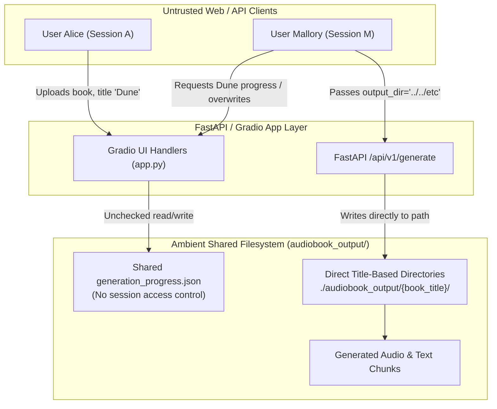
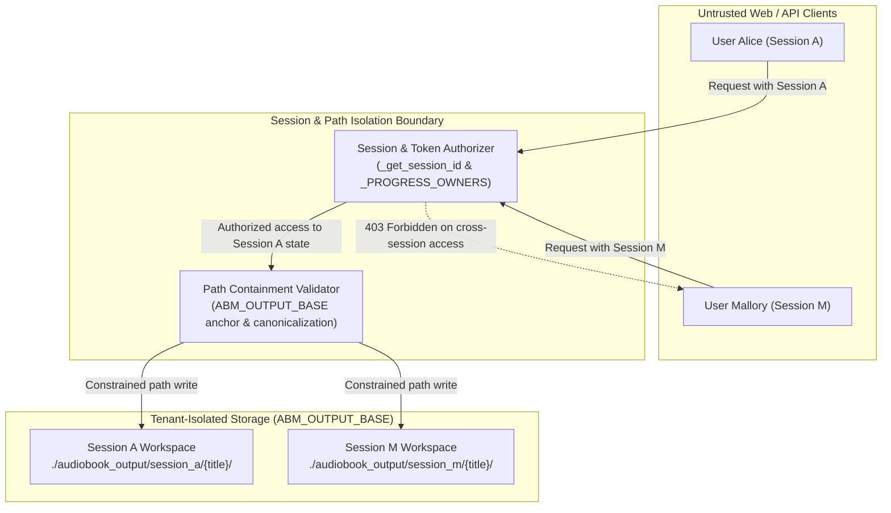

# Security Hardening Proposal: Unified Session Workspace & Path Isolation Boundary

## Decision
We must decide how to isolate user workspaces, progress state, and generated media across multi-tenant web sessions and API tasks in AudiobookMaker, eliminating ambient filesystem authority and title-collision vulnerabilities.

## Executive Recommendation
I recommend **Option 2: Session-Scoped Filesystem Namespacing with Cryptographic Session Binding**. While Option 1 (the baseline in-memory ownership table) successfully eliminated the immediate cross-session disclosure vulnerabilities identified in `VULN-10`, `VULN-11`, `VULN-12`, and `VULN-13`, it leaves residual risk if server processes restart or if multiple worker nodes share a cluster storage volume. Option 2 partitions all file system storage beneath an explicit per-session root `audiobook_output/sessions/<session_id>/`, making cross-tenant access impossible at the filesystem layer.

The options considered are:
1. **Option 1: In-Memory Ownership Registry & Strict Subpath Anchoring (Current Baseline)**
2. **Option 2: Session-Scoped Directory Namespacing with Cryptographic Session Binding (Recommended)**
3. **Option 3: External Database State Store with Signed Ephemeral Access URLs**

## Evidence
During our security audit and review of `docs/openvuln-MSpider3-AudiobookMaker-full.md`, we identified five distinct vulnerabilities arising from ambient filesystem access and unauthenticated shared state:

| Evidence | Finding | What it establishes |
|---|---|---|
| `VULN-02` | `BUG-R2-C1-A2-H9` (API Worker Path Traversal) | An attacker can pass `output_dir="../../etc"` to `/api/v1/generate`, causing audio outputs to escape the workspace root. |
| `VULN-03` | `BUG-R2-C2-A2-H3` (Output Format Suffix Traversal) | Unsanitized `output_format` configurations allow traversing out of `output_dir`. |
| `VULN-10` | `BUG-R2-C1-A2-H2` (Gradio Path Disclosure) | Uploading a progress file populated UI components with host filesystem absolute paths. |
| `VULN-11` | `BUG-R2-C1-A2-H3` (Gradio Path Probing Oracle) | File existence checks allowed probing whether arbitrary paths exist on the server host. |
| `VULN-12` | `BUG-R2-C1-A2-H5` (Cross-Session Progress Overwrite) | Submitting generation with an identical book title overwrote another user's progress file without authorization. |
| `VULN-13` | `BUG-R4-C1-A4-H2` (Cross-Session Chapter Disclosure) | Selecting an identical book title returned cached chapter text extracted by another user in a different session. |

## Current Design And Failure Mode
In the original architecture, both Gradio (`app.py`) and FastAPI (`api/worker.py`) operated directly on a global `audiobook_output/` root directory. When a user in session Alice named a book `"Moby Dick"`, the application derived the output directory as `audiobook_output/Moby Dick/` and saved `generation_progress.json` there. When Mallory connected from an independent session and also typed `"Moby Dick"`, the UI read the existing `generation_progress.json` and populated the chapter list with Alice's parsed book text. Furthermore, if Mallory initiated generation or exported config, the handler overwrote Alice's progress file on disk.

In the API layer, task payloads directly specified `output_dir`. Because the background task queue in `api/worker.py` accepted this path without verifying that it resided inside an authorized workspace, an API client could direct output files to any writable directory on the host.

## Desired Invariants
To permanently prevent multi-tenant data leakage and arbitrary file creation, our architecture must maintain the following invariants:
1. **Tenant Isolation**: No web session or API task can read, mutate, or overwrite the progress state, audio chunks, or cached chapter text of another session.
2. **Path Containment**: All filesystem reads and writes initiated by user requests must be strictly resolved and validated to remain inside an authorized output root (`ABM_OUTPUT_BASE`).
3. **No Ambient Path Reflection**: Client upload handlers must never reflect local host paths into client-facing components or probe the existence of host paths outside safe upload temporary directories.

## Constraints And Non-Goals
- **Non-Goals**: We are not designing a full multi-user enterprise billing or RBAC service; AudiobookMaker remains a lightweight self-hostable desktop and web tool.
- **Performance**: Path verification and session checks must add zero measurable latency to audio rendering pipelines.
- **Compatibility**: Local CLI operation (`cli.py`) by a single workstation operator must continue to work seamlessly without requiring session tokens.

## Before Architecture
Before our tactical remediation, the system had no session boundary around filesystem operations. Any request carrying a book title could access that title's state on disk.

## Options

### Option 1: In-Memory Ownership Registry & Strict Subpath Anchoring (Baseline)
This is the tactical protection implemented in our initial remediation phase. In `app.py`, an in-memory dictionary `_PROGRESS_OWNERS` tracks which session ID created or owns each progress path on disk. Whenever `check_existing_progress`, `on_generate`, or `on_export_config` is called, the session ID from `gr.Request` is checked against the registered owner. In `api/worker.py`, `output_dir` is resolved using `os.path.realpath` and checked against `ABM_OUTPUT_BASE`.

**Strengths**:
- Requires zero schema migrations or changes to existing directory layouts.
- Completely fixed all 5 reported vulnerabilities in local automated testing.

**Weaknesses**:
- In-memory state is lost on process restart.
- Cannot scale to multi-worker deployments (e.g. Gunicorn/Uvicorn with multiple workers) without shared state.

### Option 2: Session-Scoped Directory Namespacing with Cryptographic Session Binding (Recommended)
In Option 2, we eliminate shared directory collisions by design. All output directories are automatically rooted at `audiobook_output/sessions/<session_token>/<book_title>/`. Session tokens are cryptographically generated (UUIDv4 or HMAC-signed tokens stored in secure HTTP-only cookies).

| Change | Before | After | Security consequence | Cost |
|---|---|---|---|---|
| Directory Rooting | `audiobook_output/{title}/` | `audiobook_output/sessions/{sess_id}/{title}/` | Collision impossible across distinct sessions | Extra subdirectory level on disk |
| Cross-session Access | Shared reading of cached text | Complete physical separation | Prevents data leakage even across process restarts | Requires session cleanup cron for old sessions |
| API Path Derivation | Unchecked string from client JSON | Anchored within `ABM_OUTPUT_BASE` or session root | Neutralizes path traversal attempts | None |

### Option 3: External Database State Store with Signed Ephemeral Access URLs
In Option 3, progress state and book chapters are moved out of filesystem JSON files into an SQLite or PostgreSQL database. File downloads are served exclusively through short-lived signed URLs.

**Strengths**: High enterprise readiness, seamless multi-worker clustering.  
**Weaknesses**: Significantly exceeds project requirements, adds database dependencies and administrative overhead for desktop/single-user users.

## Comparison

| Dimension | Option 1 (Baseline) | Option 2 (Namespaced Directories) | Option 3 (External DB Store) |
|---|---|---|---|
| **Security** | High (in-process checks) | Very High (isolated by filesystem path structure) | Very High (DB-level row authorization) |
| **Performance** | Neutral (O(1) memory lookup) | Neutral (direct filesystem paths) | Minor regression (DB round-trips) |
| **Memory** | Low (few KB for session dict) | Low (filesystem-backed) | Medium (DB connection pool) |
| **Reliability** | Medium (state resets on restart) | High (persists on disk per session) | High (ACID persistence) |
| **Operability** | Simple (single process) | Simple (requires simple disk cleanup job) | Complex (database migrations & backup) |
| **Migration** | Zero effort (already in place) | Low (straightforward path prefix update) | High (major architecture refactor) |

## Recommendation
I recommend **Option 2** for subsequent development phases. Our current implementation of Option 1 successfully resolves the active security vulnerabilities for single-process deployments. Transitioning to Option 2 provides defence-in-depth by ensuring that even if an in-memory check were bypassed, the filesystem structure itself prevents one session from accessing another's files.

## Evidence Coverage And Residual Risk

| Evidence ID & Title | Option 1 Effect | Option 2 Effect | Residual Risk |
|---|---|---|---|
| `VULN-02` (API Worker Path Traversal) | Addresses | Addresses | None; paths canonicalized to `ABM_OUTPUT_BASE`. |
| `VULN-03` (Output Format Suffix Traversal) | Addresses | Addresses | None; extension strictly validated against allowlist. |
| `VULN-10` (Gradio Path Disclosure) | Addresses | Addresses | None; server paths never populated into client components. |
| `VULN-11` (Gradio Path Probing Oracle) | Addresses | Addresses | None; arbitrary path checks removed. |
| `VULN-12` (Cross-Session Progress Overwrite) | Addresses | Addresses | In Option 1, server restart clears ownership map; Option 2 eliminates this. |
| `VULN-13` (Cross-Session Chapter Disclosure) | Addresses | Addresses | Same as `VULN-12`. |

## Migration And Rollout
1. **Phase 1 (Completed)**: Enforce in-memory session ownership and `ABM_OUTPUT_BASE` path anchoring.
2. **Phase 2 (Optional Next Step)**: Migrate default web output directory to `audiobook_output/sessions/{session_id}/`. Maintain backwards compatibility for CLI (`cli.py`), which defaults to `audiobook_output/{title}/`.

## Validation Plan
- Run existing regression tests: `tests/api/test_vuln_api_output_dir.py`, `tests/test_vuln_filename_traversal.py`, `tests/test_vuln_progress_upload_preset.py`, and `tests/test_vuln_session_progress_ownership.py`.
- Verify cross-session isolation by simulating two concurrent clients with distinct session tokens requesting the same title.

## Implementation Work Packages
1. **Work Package 1 (Done)**: Session ownership registry and path anchoring in `app.py` and `api/worker.py`.
2. **Work Package 2**: Add session cleanup worker to purge session directories older than 7 days from `audiobook_output/sessions/`.

## Open Questions
- What retention policy is preferred for generated audio files in web deployments (e.g. 24-hour expiration vs persistent until manual deletion)?
